# misarta

**misarta** は Rust 製の剛体力学ライブラリです。C++ の [Pinocchio](https://github.com/stack-of-tasks/pinocchio) と同等の運動学・動力学・最適化機能を提供します。

- **名前の由来**: misa (Misato) + art (Articulation) + ta (Takara)
- **依存**: `nalgebra`（行列演算）、`parry3d-f64`（衝突検出）、`clarabel`（QP ソルバー、optional）
- **ソース規模**: 約 19,500 行 / 31 モジュール

---

## 概要

Featherstone の空間代数に基づく O(n) アルゴリズム群を Rust のジェネリクスで実装しています。`T: RealField` トレイト境界により、`f64` での数値計算に加え、二重数（Dual number）による自動微分にも対応します。

**設計原則**:

| 原則 | 内容 |
|------|------|
| **参照透明性** | 全アルゴリズムは副作用のない純粋関数 |
| **Model / Data 分離** | 不変のロボット記述 (`Model`) と可変の計算結果 (`Data`) を分離 |
| **ジェネリクス** | `T: RealField` による自動微分対応 |
| **Featherstone 記法** | 空間ベクトル `[angular(3); linear(3)]` に統一 |

---

## ソフトウェアスタック

```mermaid
graph TD
    subgraph "Layer 0 — 基盤"
        SE3[se3<br><i>SE&#40;3&#41; Lie 群</i>]
        QP[qp<br><i>密 QP ソルバー</i>]
        TRAJ[trajectory<br><i>軌道補間</i>]
    end

    subgraph "Layer 1 — コア型"
        JOINT[joint<br><i>関節型 enum</i>]
        MESH[mesh<br><i>メッシュ I/O</i>]
    end

    subgraph "Layer 2 — モデル"
        MODEL[model<br><i>ロボットモデル</i>]
        GEOM[geometry<br><i>ジオメトリ</i>]
        DATA[data<br><i>計算結果</i>]
        COLLADA[collada<br><i>DAE 読み書き</i>]
    end

    subgraph "Layer 3 — 運動学"
        FK[fk<br><i>順運動学</i>]
        MANIFOLD[manifold<br><i>構成空間多様体</i>]
    end

    subgraph "Layer 4 — ヤコビアン・逆動力学"
        JAC[jacobian<br><i>幾何学的ヤコビアン</i>]
        RNEA[rnea<br><i>逆動力学 RNEA</i>]
    end

    subgraph "Layer 5 — 動力学"
        CRBA[crba<br><i>質量行列 CRBA</i>]
        FRAMES[frames<br><i>操作空間フレーム</i>]
        CENT[centroidal<br><i>セントロイダル</i>]
        LIMITS[limits<br><i>関節制限</i>]
    end

    subgraph "Layer 6 — 高次動力学"
        ABA[aba<br><i>順動力学 ABA</i>]
        RNEAD[rnea_derivatives<br><i>RNEA 微分</i>]
        CONSD[constrained<br><i>拘束付き動力学</i>]
    end

    subgraph "Layer 7 — ユーティリティ"
        ABAD[aba_derivatives<br><i>ABA 微分</i>]
        COLL[collision<br><i>衝突検出</i>]
        UTILS[utils<br><i>数値微分</i>]
        KUTILS[kinematics_utils<br><i>運動学ユーティリティ</i>]
    end

    subgraph "Layer 8 — アプリケーション"
        IK[ik<br><i>逆運動学</i>]
        OPT[optimization<br><i>iLQR 最適化</i>]
        REDUCED[reduced<br><i>モデル縮約</i>]
        CONS[constraint<br><i>拘束付き IK</i>]
        MIMIC[mimic<br><i>連動関節</i>]
    end

    subgraph "Layer 9 — ローダー"
        URDF[urdf<br><i>URDF パーサー</i>]
        SDF[sdf<br><i>SDF パーサー</i>]
    end

    %% Layer 0 → 1
    SE3 --> JOINT

    %% Layer 0–1 → 2
    JOINT --> MODEL
    SE3 --> MODEL
    SE3 --> GEOM
    MESH --> GEOM
    MESH --> COLLADA
    SE3 --> DATA
    MODEL --> DATA

    %% Layer 2 → 3
    MODEL --> FK
    DATA --> FK
    SE3 --> FK
    MODEL --> MANIFOLD
    JOINT --> MANIFOLD
    SE3 --> MANIFOLD

    %% Layer 3 → 4
    FK --> JAC
    MODEL --> JAC
    DATA --> JAC
    SE3 --> JAC
    MODEL --> RNEA
    SE3 --> RNEA

    %% Layer 4 → 5
    RNEA --> CRBA
    MODEL --> CRBA
    SE3 --> CRBA
    JAC --> FRAMES
    FK --> FRAMES
    MODEL --> FRAMES
    SE3 --> FRAMES
    JAC --> CENT
    FK --> CENT
    MODEL --> CENT
    SE3 --> CENT
    MANIFOLD --> LIMITS
    MODEL --> LIMITS
    JOINT --> LIMITS

    %% Layer 5 → 6
    CRBA --> ABA
    RNEA --> ABA
    MODEL --> ABA
    SE3 --> ABA
    CRBA --> RNEAD
    RNEA --> RNEAD
    MODEL --> RNEAD
    SE3 --> RNEAD
    CRBA --> CONSD
    RNEA --> CONSD
    ABA --> CONSD
    MODEL --> CONSD
    SE3 --> CONSD

    %% Layer 6 → 7
    ABA --> ABAD
    RNEAD --> ABAD
    MODEL --> ABAD
    SE3 --> ABAD
    FK --> COLL
    GEOM --> COLL
    MODEL --> COLL
    SE3 --> COLL
    FK --> UTILS
    MODEL --> UTILS
    SE3 --> UTILS
    FK --> KUTILS
    JAC --> KUTILS
    MODEL --> KUTILS
    SE3 --> KUTILS

    %% Layer 7–8
    FK --> IK
    JAC --> IK
    FRAMES --> IK
    MANIFOLD --> IK
    LIMITS --> IK
    COLL --> IK
    MODEL --> IK
    SE3 --> IK
    GEOM --> IK
    ABA --> OPT
    FK --> OPT
    JAC --> OPT
    MANIFOLD --> OPT
    LIMITS --> OPT
    MODEL --> OPT
    SE3 --> OPT
    FK --> REDUCED
    JAC --> REDUCED
    FRAMES --> REDUCED
    GEOM --> REDUCED
    ABA --> REDUCED
    CRBA --> REDUCED
    RNEA --> REDUCED
    MODEL --> REDUCED
    SE3 --> REDUCED
    FK --> CONS
    JAC --> CONS
    FRAMES --> CONS
    CONSD --> CONS
    QP --> CONS
    DATA --> CONS
    MODEL --> CONS
    SE3 --> CONS
    FK --> MIMIC
    MODEL --> MIMIC
    SE3 --> MIMIC

    %% Layer 9
    GEOM --> URDF
    JOINT --> URDF
    MODEL --> URDF
    SE3 --> URDF
    GEOM --> SDF
    JOINT --> SDF
    MODEL --> SDF
    SE3 --> SDF
```



### レイヤー概要

| レイヤー | モジュール群 | 役割 |
|---------|-------------|------|
| **L0 基盤** | `se3`, `qp`, `trajectory` | 外部依存のない純粋な数学基盤。SE(3) Lie 群演算、QP ソルバー、軌道補間 |
| **L1 コア型** | `joint`, `mesh` | 関節型定義 (Revolute/Prismatic/Fixed/FreeFlyer) とメッシュ I/O |
| **L2 モデル** | `model`, `geometry`, `data`, `collada` | ロボットのトポロジ・慣性・ジオメトリを記述する不変データ構造 |
| **L3 運動学** | `fk`, `manifold` | 順運動学（0次/1次/2次）と構成空間多様体操作 |
| **L4 ヤコビアン・逆動力学** | `jacobian`, `rnea` | 幾何学的ヤコビアンと RNEA による逆動力学 $\tau = M\ddot{q}+C\dot{q}+g$ |
| **L5 動力学** | `crba`, `frames`, `centroidal`, `limits` | 質量行列、操作空間フレーム、セントロイダルモメンタム、関節制限 |
| **L6 高次動力学** | `aba`, `rnea_derivatives`, `constrained` | ABA 順動力学、RNEA 解析的微分、拘束付き動力学 |
| **L7 ユーティリティ** | `aba_derivatives`, `collision`, `utils`, `kinematics_utils` | ABA 微分、衝突検出、数値微分、運動学ヘルパー |
| **L8 アプリケーション** | `ik`, `optimization`, `reduced`, `constraint`, `mimic` | 逆運動学ソルバー、iLQR 最適化、モデル縮約、拘束付き IK、連動関節 |
| **L9 ローダー** | `urdf`, `sdf` | URDF / SDF フォーマットの読み書き |

---

## 主要 API

```rust
use misarta::{model, fk, jacobian, rnea, crba, aba, urdf};

// URDF からモデルを読み込み
let model = urdf::build_model_from_urdf(urdf_str, &root);

// 順運動学
let data = fk::forward_kinematics(&model, &q);

// 幾何学的ヤコビアン
let J = jacobian::compute_frame_jacobian(&model, &q, frame_id, ref_frame);

// 逆動力学 (RNEA)
let tau = rnea::rnea(&model, &q, &v, &a);

// 質量行列 (CRBA)
let M = crba::crba(&model, &q);

// 順動力学 (ABA)
let ddq = aba::aba(&model, &q, &v, &tau);
```

---

## ライセンス

articara プロジェクトのライセンスに準じます。
